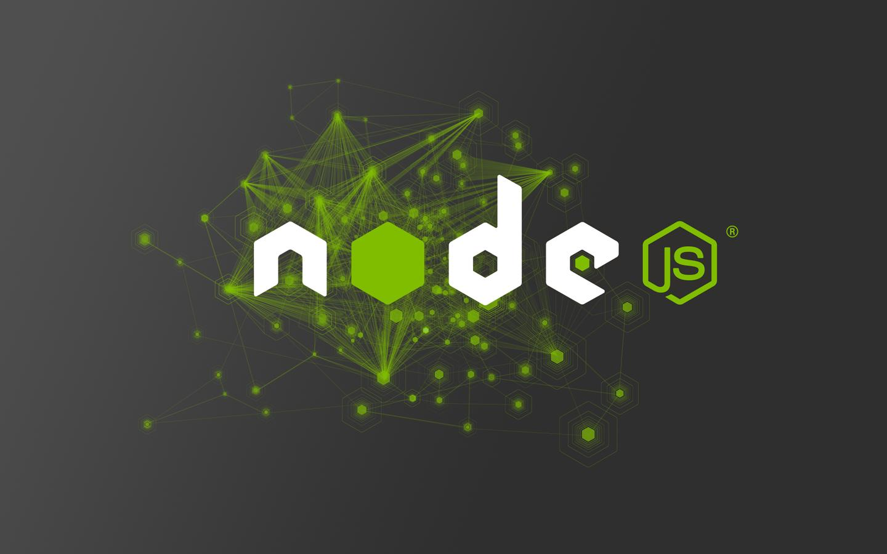
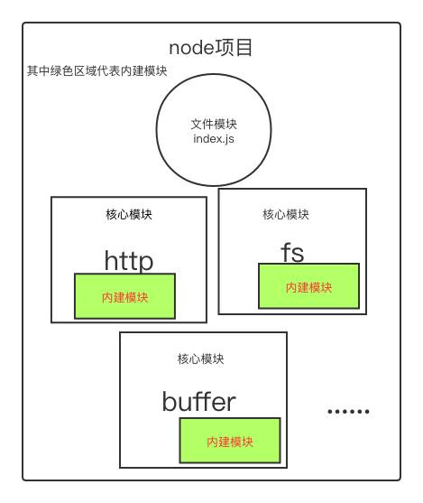

# 一、做我女朋友好吗？

<blockquote style='padding: 10px; font-size: 1em; margin: 1em 0px; color: rgb(0, 0, 0); border-left: 5px solid rgba(0,189,170,1); background: rgb(239, 235, 233);line-height:1.5;'>
某日，我鼠标右键熟练的创建了一个test目录，执行了npm init -y生成了一个package.json的node项目，紧接着进入该目录并右键熟练的创建了一个index.js文件，我写下了这样一行代码：
</blockquote>

```js
console.log("做我女朋友好吗？")
```
<blockquote style='padding: 10px; font-size: 1em; margin: 1em 0px; color: rgb(0, 0, 0); border-left: 5px solid rgba(0,189,170,1); background: rgb(239, 235, 233);line-height:1.5;'>
是的，正如这行console.log所描述的一样，我想要一个女朋友，但是我却不知道对谁说出这几个字。现在整个文件夹下面只有<a  href="http://nodejs.cn/learn/the-package-json-guide">package.json</a>文件和一个index.js文件，这个时候我熟练的执行node index.js命令，这个时候，控制台输出了“我想要女朋友”。<br /><br />
就是这短短的7个字，不知道有没有打动你的心，但是却引发了我的思考，为啥node index.js就可以在控制台输出这7个字呢？心里产生了深深的好奇。
</blockquote>

# 二、抛弃想要女朋友的年头，探究Nodejs源码

<blockquote style='padding: 10px; font-size: 1em; margin: 1em 0px; color: rgb(0, 0, 0); border-left: 5px solid rgba(0,189,170,1); background: rgb(239, 235, 233);line-height:1.5;'>
抛弃女人念头的理由有二点：<br />
第一：女人这种东西，是留给高富帅的，我等屌丝不配拥其入怀。<br /> 
第二：女人会影响敲代码的速度，影响自身的成长和学习。女人会使男人大量分泌多巴胺，而多巴胺是人体行动力的主要原因，多巴胺长期维持一个很高的水平，会使体内多巴胺受体减少，也就更加抑制了多巴胺的分泌，会使人失去学习的动力。
<br /><br />
故打开<a href="https://github.com/nodejs/node">Nodejs</a>的github源码目录。点击Download ZIP下载安装包。
</blockquote>

## 1.node-v14.16.0目录结构 

<blockquote style='padding: 10px; font-size: 1em; margin: 1em 0px; color: rgb(0, 0, 0); border-left: 5px solid rgba(0,189,170,1); background: rgb(239, 235, 233);line-height:1.5;'>
写源码解析，不加源码版本号是一种非常不道德的行为。我们这里的版本号是14.16.0。
</blockquote>


## 2.Nodejs模块分类

<blockquote style='padding: 10px; font-size: 1em; margin: 1em 0px; color: rgb(0, 0, 0); border-left: 5px solid rgba(0,189,170,1); background: rgb(239, 235, 233);line-height:1.5;'>
在Node中，模块分为以下3类：
</blockquote>

### 1.文件模块

<blockquote style='padding: 10px; font-size: 1em; margin: 1em 0px; color: rgb(0, 0, 0); border-left: 5px solid rgba(0,189,170,1); background: rgb(239, 235, 233);line-height:1.5;'>
用户编写的、非Node.js源码自带的模块都可以统称文件模块，即我们平时写项目使用的第三方类库如webpack、vue、react等等。
</blockquote>

### 2.核心模块

<blockquote style='padding: 10px; font-size: 1em; margin: 1em 0px; color: rgb(0, 0, 0); border-left: 5px solid rgba(0,189,170,1); background: rgb(239, 235, 233);line-height:1.5;'>
包含在Node.js源码中，被编译进Node.js可执行二进制文件JavaScript模块。比如常用的http,fs等等。
</blockquote>

### 3.内建模块

<blockquote style='padding: 10px; font-size: 1em; margin: 1em 0px; color: rgb(0, 0, 0); border-left: 5px solid rgba(0,189,170,1); background: rgb(239, 235, 233);line-height:1.5;'>
在核心模块里，有些模块全部由C/C++编写，有些模块则由C/C++完成核心部分，其他部分则由JS实现包装或向外导出，以满足性能需求。在这里我们将那些由C/C++C/C++编写的部分统一成为称为内建模块，因为他们通常不被用户直接调用。Node里的buffer、crypto、evals、fs、os等模块都是部分通过C/C++编写的。
</blockquote>

### 4.关系图

我们可以通过上面得出一个完整的Node项目模块结构



