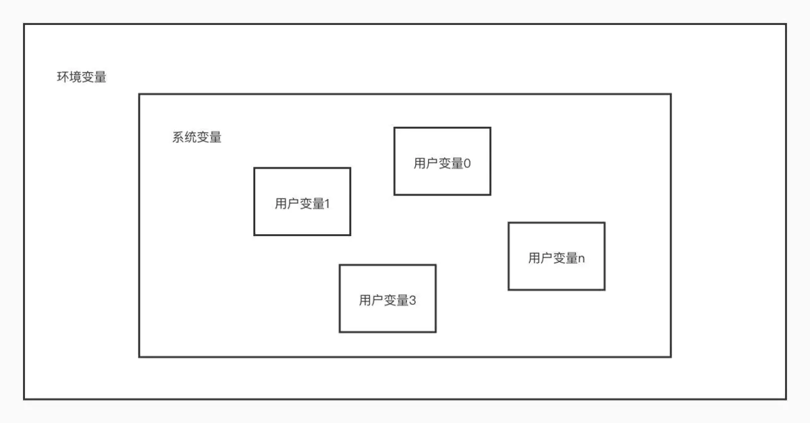
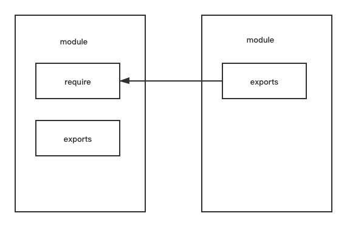

# 一、做我女朋友好吗？

<blockquote style='padding: 10px; font-size: 1em; margin: 1em 0px; color: rgb(0, 0, 0); border-left: 5px solid rgba(0,189,170,1); background: rgb(239, 235, 233);line-height:1.5;'>
某日，我鼠标右键熟练的创建了一个test目录，执行了npm init -y生成了一个package.json的node项目，紧接着进入该目录并右键熟练的创建了一个index.js文件，我写下了这样一行代码：
</blockquote>

```js
console.log("做我女朋友好吗？")
```
<blockquote style='padding: 10px; font-size: 1em; margin: 1em 0px; color: rgb(0, 0, 0); border-left: 5px solid rgba(0,189,170,1); background: rgb(239, 235, 233);line-height:1.5;'>
是的，正如这行console.log所描述的一样，我想要一个女朋友，但是我却不知道对谁说出这几个字。现在整个文件夹下面只有<a  href="http://nodejs.cn/learn/the-package-json-guide">package.json</a>文件和一个index.js文件，这个时候我熟练的执行node index.js命令，这个时候，控制台输出了“做我女朋友好吗？”。<br /><br />
就是这短短的7个字，不知道有没有打动你的心，但是却引发了我的思考，为啥node index.js就可以在控制台输出这7个字呢？心里产生了深深的好奇。
</blockquote>

# 二、抛弃想要女朋友的年头，探究Nodejs源码，node-v14.16.0目录结构 探索

<blockquote style='padding: 10px; font-size: 1em; margin: 1em 0px; color: rgb(0, 0, 0); border-left: 5px solid rgba(0,189,170,1); background: rgb(239, 235, 233);line-height:1.5;'>
抛弃女人念头的理由有二点：<br />
第一：女人这种东西，是留给高富帅的，我等屌丝不配拥其入怀。<br /> 
第二：女人会影响敲代码的速度，影响自身的成长和学习。女人会使男人大量分泌多巴胺，而多巴胺是人体行动力的主要原因，多巴胺长期维持一个很高的水平，会使体内多巴胺受体减少，也就更加抑制了多巴胺的分泌，会使人失去学习的动力。
<br /><br />
故打开<a href="https://github.com/nodejs/node">Nodejs</a>的github源码目录。点击Download ZIP下载安装包。
</blockquote>
 

<blockquote style='padding: 10px; font-size: 1em; margin: 1em 0px; color: rgb(0, 0, 0); border-left: 5px solid rgba(0,189,170,1); background: rgb(239, 235, 233);line-height:1.5;'>
写源码解析，不加源码版本号是一种非常不道德的行为。我们这里的版本号是14.16.0。（以下省略了一些不重要的模块以及一些文档文件）
</blockquote>

｜—— benchmark  暂时没有找到相关文档，但是根据一个著名的js库benchmark.js并且里面都是一些js核心模块可以大概推测这是node.js模块进行基准测试的。<br />
｜—— deps Node.js依赖的一些包,使得Nodejs在各个平台上跑得飞起。<a href="https://nodejs.org/en/docs/meta/topics/dependencies/">官网Dependencies</a>有描述。<br />
｜—— —— <a href="https://github.com/acornjs/acorn">acorn</a> 一款体积小但效率高的javascript解析器。 <br />
｜—— —— <a href="https://github.com/acornjs">acorn-plugins</a> acorn使用的一些插件，从名称上来看，该版本的Nodejs支持bigInt特性、支持private类和方法特性等等。<br />
｜—— —— <a href="https://github.com/google/brotli">brotli</a> 提供C语言版本的Brotli压缩算法实现。<br />
｜—— —— <a href="https://github.com/royalpinto/node-cares">cares</a> 从node.js dns模块派生而来，node-cares为c-ares库提供了node.js接口。<br />
｜—— —— <a href="https://www.npmjs.com/package/cjs-module-lexer">cjs-module-lexer</a> 一个非常快速的JS CommonJS模块语法词法分析器，用于检测CommonJS模块的最有可能的命名输出列表。<br />
｜—— —— <a href="https://github.com/HdrHistogram/HdrHistogram_c">histogram</a> C语言版本实现高动态范围的柱状图。<br />
｜—— —— <a href="https://www.npmjs.com/package/node-icu">icu-small</a> ICU(International Components for Unicode)是一套成熟并广泛使用的C/C++和Java库集合，为软件应用提供Unicode和Globalization的支持。<br />
｜—— —— <a href="https://github.com/nodejs/llhttp">llhttp</a> 更加高性能可维护性更好的http解析器。<br />
｜—— —— <a href="https://nghttp2.org/">nghttp2</a> HTTP/2协议的C语言实现，头部压缩算法使用了HPACK。<br />
｜—— —— <a href="https://github.com/nodejs/node-inspect">node-inspect</a> 该库尝试在新的V8版本下提供node debug命令。<br />
｜—— —— <a href="https://nodejs.org/zh-cn/knowledge/getting-started/npm/what-is-npm/">npm</a> npm有两点：首先，它是一个用于发布开源Node.js项目的在线存储库；其次，它是一个命令行实用程序，用于与所述存储库进行交互，有助于软件包安装，版本管理和依赖项管理。在npm上发布了大量的Node.js库和应用程序，并且每天都在增加<br />
｜—— —— <a href="https://www.openssl.org/docs/">openssl</a> OpenSSL在tls和密码模块中都得到了广泛的应用。它提供了经过严密测试的许多加密功能的实现，现代web依赖这些功能来实现安全性。<br />
｜—— —— <a href="https://github.com/libuv/libuv">uv</a> Nodejs的一大精髓之一，提供Nodejs访问操作系统各种特性的能力，包括文件系统、Socket等。<br />
｜—— —— <a href="https://github.com/nodejs/uvwasi">uvwasi</a> uvwasi实现WASI系统调用API。在后台，尽可能uvwasi 利用libuv来实现最大的可移植性。<br />
｜—— —— <a href="https://github.com/nodejs/uvwasi">v8</a> 将Js代码编译为底层机器码。<br />
｜—— —— <a href="https://www.zlib.net/manual.html">zlib</a> 为了实现快速得压缩和解压缩，Node.js依赖于工业标准的zlib库，也因其在gzip和libpng中的使用而闻名。Nodejs用zlib来创建同步的、或异步或流式的压缩和解压缩接口。<br />
｜—— doc 由名字可得知里面存放的是一些nodejs相关源码的文档等。<br />
｜—— lib 包含了所有nodejs函数和模块的javascript实现，这些实现都是可以直接在你js项目中引用进去的。<br />
｜—— src 包含了所有函数的C++版本实现，这里的代码才会真正引用Libuv和V8。<br />
｜—— test 一些测试文件。<br />
｜—— tools 包含可以一些sh脚本构建工具、编译C++、编译JS的一些工具。<br />
｜—— android-configure 可以帮助构建Android的Node.js。<br />
｜—— vcbuild.bat  在 Windows 平台上，Node.js 采用 gyp 来生成 Visual Studio Solution 文件，最终通过 VC++ 的编译器将其编译为二进制文件。这里的vcbuild.bat就相当于VC++ 的编译器，执行vcbuild.bat release 会生成node.exe文件用于window平台使用。（tips：bat为批处理文件，在命令提示下键入批处理文件的名称，或者双击该批处理文件，系统就会调用cmd.exe按照该文件中各个命令出现的顺序来逐个运行它们。cmd.exe通过命令行界面与用户进行交互。在Windows上，此接口是通过Win32控制台实现的。cmd.exe可能会利用其自身平台的本机程序可用的功能。例如，在OS / 2和Windows，它可以使用真正的管道命令管道，使管道的两侧同时运行。）<br />
｜—— node.gyp  在 Unix/Linux 平台上，Node.js 也采用 gyp 来生成 Visual Studio Solution 文件，不同的是通过 make 工具进行最终的编译。Node.js 源码中我们可以看到一个 node.gyp，这个文件中的内容是由 python 写成的一些 JSON-like 配置，定义了一连串的构建工程任务。<br /> 
｜—— Makefile  在Unix/Linux平台上生成可执行二进制文件的配置文件。<br />

# 三、思考不同平台下执行可执行文件的过程

<blockquote style='padding: 10px; font-size: 1em; margin: 1em 0px; color: rgb(0, 0, 0); border-left: 5px solid rgba(0,189,170,1); background: rgb(239, 235, 233);line-height:1.5;'>
在上节中，我们可以得出这样的一个结论：<br />
1.在window中Node.js 采用 gyp 来生成 Visual Studio Solution 文件，最终通过 VC++ 的编译器将其编译为二进制文件,即Node.exe文件。<br />
2.在mac中Node.js采用gyp来生成Visual Studio Solution 文件，区别与window平台，他使用make将文件转化了unix格式的可执行文件。<br />
</blockquote>

## 1.什么是环境变量？

<blockquote style='padding: 10px; font-size: 1em; margin: 1em 0px; color: rgb(0, 0, 0); border-left: 5px solid rgba(0,189,170,1); background: rgb(239, 235, 233);line-height:1.5;'>
相信大家初学Node，肯定会涉及到“配置环境变量”（高版本Node 安装包自动将我们配置好环境变量），几乎所有的教程都会告诉你当你在命令行工具中输入了 node -V 命令后看到类似如下的结果就说明你的 Java 环境配置好了 👇真正说明为什么要去配置环境变量的不多。<br /> <br />
不知道你有没有思考过这个「环境变量」究竟是什么？为什么配置了之后就会显示这样的内容，为什么不配置，就会提示你一个错误：'node' 不是内部命令或外部命令，也不是可运行的程序(.exe文件)或批处理文件(.bat文件)。
 
</blockquote>

### 1.从打开软件的两种方式说起

<blockquote style='padding: 10px; font-size: 1em; margin: 1em 0px; color: rgb(0, 0, 0); border-left: 5px solid rgba(0,189,170,1); background: rgb(239, 235, 233);line-height:1.5;'>
我们平时打开一个应用程序，一般是双击桌面图标或在开始菜单链接，无论是桌面的快捷图标还是菜单链接都包含了应用程序的安装位置信息，打开它们的时候系统会按照这些位置信息找到安装目录然后启动程序，这里在Mac这个平台并以 Wechat 这个软件为例。<br /><br />
1.我们也可以通过命令行工具进入启动程序所在的文件，通过命令打开，如笔者 Wechat.exec 的位置为<code>/Applications/WeChat.app/Contents/MacOS/WeChat</code>,使用 cd 命令进入该目录，再输入<code>.\Wechat</code>，即可通过命令启动 Wechat。<br /><br />
2.如果想要炫技，每次都先进入安装目录再打开文件显然有些麻烦，那有没有什么简单的方式，直接在命令行工具中输入 Wechat 甚至直接输入 Wechat 就能打开软件呢？那就是配置环境变量。
</blockquote>

### 2.原因

<blockquote style='padding: 10px; font-size: 1em; margin: 1em 0px; color: rgb(0, 0, 0); border-left: 5px solid rgba(0,189,170,1); background: rgb(239, 235, 233);line-height:1.5;'>
为什么配置环境变量前，直接输入 WeChat 无法打开软件呢？<br /></br />
这是因为操作系统并不知道你的 WeChat.exec 这个文件在哪里，所以无法执行对应的文件。<br /></br />
那么为了能够让操作系统找到这个可执行文件，我们就需要把 WeChat.exec 这个 可执行文件所在的目录作为 PATH 环境变量的一部分设置起来，这样当你在命令行输入一个命令的时候，操作系统就会自动搜索 PATH 变量中所指定的所有目录 了。 <br /></br />
在 Windows 系统中 PATH 变量中的所有路径采用分号分割，如果在 Linux 系统中采用冒号分割。 <br /></br />
</blockquote>

### 3.环境变量

<blockquote style='padding: 10px; font-size: 1em; margin: 1em 0px; color: rgb(0, 0, 0); border-left: 5px solid rgba(0,189,170,1); background: rgb(239, 235, 233);line-height:1.5;'>
上面所说的 PATH 变量其实就是环境变量，和他的名字一样，环境变量是描述环境的变量，是指在操作系统中用来指定操作系统运行环境的变量。它包含了一个或者多个应用程序所将使用到的信息。<br /></br />
例如 Windows 和 DOS 操作系统中的 PATH 环境变量，当要求系统运行一个程序而没有告诉它程序所在的完整路径时，系统除了在当前目录下面寻找此程序外，还应到 PATH 中指定的路径去找。用户通过设置环境变量，来更好的运行进程。<br /><br />
你在命令行里输入的那几个符号，其实就是一些可执行程序的名字(标签、别名)，是可以直接被当前系统直接执行的程序。如果是在 Windows 系统中，则这些被输入的符号就是可以直接被 windows 系统执行、后缀为'.exe'的程序(文件)。 Mac系统对应的则为exec文件。
</blockquote>

### 4.系统变量 OR 用户变量

<blockquote style='padding: 10px; font-size: 1em; margin: 1em 0px; color: rgb(0, 0, 0); border-left: 5px solid rgba(0,189,170,1); background: rgb(239, 235, 233);line-height:1.5;'>
相信细心的小伙伴已经发现了，在上图的页面中除了用户变量还有一个叫系统变量的。<br /><br />

事实上，环境变量是一个总称，代表了系统变量和用户变量，因此我们说环境变量都是指的系统变量和用户变量。系统变量就是系统级别的变量，用户需要使用系统变量。如果系统变量被修改了，而任何系统用户都在用系统变量，因此每个系统用户都将受到影响。用户变量运行在系统变量之上的，每个用户拥有不同的用户变量，不同用户的用户变量之间是并列的，也是互不干扰的。他们之间的关系图如下如所示： 
</blockquote>




## 2.Window平台下是如何运行exe文件的？

<blockquote style='padding: 10px; font-size: 1em; margin: 1em 0px; color: rgb(0, 0, 0); border-left: 5px solid rgba(0,189,170,1); background: rgb(239, 235, 233);line-height:1.5;'>
从OS层说起吧。<br /><br />
OS都有加载程序的功能，一个可执行文件（比如exe，com等）内部都是机器指令（cpu相关的）和数据，所以可执行文件和OS以及编译器是密切相关的，不同的OS下不同的编译器产生的可执行文件都不尽相同。不同的平台上其格式大概有elf，pe，coff等。大致都是段的形式来表示。而OS的功能就是读懂这些文件然后完成从磁盘文件到内存的映射工作，也就是适当的时候把文件的内容搬到内存适当的位置 。<br /><br />
OS加载的过程就是进程创建的过程，进程创建完毕后，会找到“入口函数”去执行。<br /><br />
进入入口函数后就等于进入了运行库，因为入口函数就是运行库的一部分。<br /><br />
入口函数开始初始化运行程序和程序的运行环境，比如堆的初始化，I/O初始化，线程的准备，全局变量等的初始化。<br /><br />
下一步就进入程序的主体，也就是调用main函数部分。<br /><br />
main函数执行结束后又回到入口函数，此时入口函数要进行一些清理工作。<br /><br />
清理完成后执行一个系统调用来kill掉进程。<br /><br />
</blockquote>

## 3.Mac平台下是如何运行exec文件的？

<blockquote style='padding: 10px; font-size: 1em; margin: 1em 0px; color: rgb(0, 0, 0); border-left: 5px solid rgba(0,189,170,1); background: rgb(239, 235, 233);line-height:1.5;'>
😅尴尬百度不到，扔个<a href="https://juejin.cn/post/6844903511612899336">链接吧</a>
</blockquote>

# 四、Node的模块分类
 
<blockquote style='padding: 10px; font-size: 1em; margin: 1em 0px; color: rgb(0, 0, 0); border-left: 5px solid rgba(0,189,170,1); background: rgb(239, 235, 233);line-height:1.5;'>
在Node中，模块分为以下3类：
</blockquote>

### 1.文件模块

<blockquote style='padding: 10px; font-size: 1em; margin: 1em 0px; color: rgb(0, 0, 0); border-left: 5px solid rgba(0,189,170,1); background: rgb(239, 235, 233);line-height:1.5;'>
用户编写的、非Node.js源码自带的模块都可以统称文件模块，即我们平时写项目使用的第三方类库如webpack、vue、react等等。
</blockquote>

### 2.核心模块

<blockquote style='padding: 10px; font-size: 1em; margin: 1em 0px; color: rgb(0, 0, 0); border-left: 5px solid rgba(0,189,170,1); background: rgb(239, 235, 233);line-height:1.5;'>
包含在Node.js源码中，被编译进Node.js可执行二进制文件JavaScript模块。比如常用的http,fs等等。
</blockquote>

### 3.内建模块

<blockquote style='padding: 10px; font-size: 1em; margin: 1em 0px; color: rgb(0, 0, 0); border-left: 5px solid rgba(0,189,170,1); background: rgb(239, 235, 233);line-height:1.5;'>
在核心模块里，有些模块全部由C/C++编写，有些模块则由C/C++完成核心部分，其他部分则由JS实现包装或向外导出，以满足性能需求。在这里我们将那些由C/C++C/C++编写的部分统一成为称为内建模块，因为他们通常不被用户直接调用。Node里的buffer、crypto、evals、fs、os等模块都是部分通过C/C++编写的。
</blockquote>

### 4.关系图

我们可以通过上面得出一个完整的Node项目模块结构


# 五、CommonJs的模块规范

<blockquote style='padding: 10px; font-size: 1em; margin: 1em 0px; color: rgb(0, 0, 0); border-left: 5px solid rgba(0,189,170,1); background: rgb(239, 235, 233);line-height:1.5;'>
CommonJS对模块的定义十分简单，主要分为模块引用、模块定义和模块标识三个部分。
</blockquote>

## 1.模块引用


<blockquote style='padding: 10px; font-size: 1em; margin: 1em 0px; color: rgb(0, 0, 0); border-left: 5px solid rgba(0,189,170,1); background: rgb(239, 235, 233);line-height:1.5;'>
模块引用的实例代码如下：<br />
<code>var math=require('math')</code><br />
在CommonJS规范中，存在require()方法，这个方法接受模块标识，从此引入一个模块的API到当前上下文中。
</blockquote>

## 2.模块定义

<blockquote style='padding: 10px; font-size: 1em; margin: 1em 0px; color: rgb(0, 0, 0); border-left: 5px solid rgba(0,189,170,1); background: rgb(239, 235, 233);line-height:1.5;'>
在模块中，上下文提供require()方法来引入外部模块。对应引入的功能，上下文提供了exports对象用于导出当前模块的方法或者变量，并且它是唯一导出的出口。在模块中，还存在一个module对象，它代表模块自身，而exports是module的属性。在Node中，一个文件就是一个块，将方法挂载在exports对象上作为属性即可定义导出的方式： 

</blockquote>

```js
//math.js
exports.add=function(num1,num2){
    return num1+num2;
}
```

<blockquote style='padding: 10px; font-size: 1em; margin: 1em 0px; color: rgb(0, 0, 0); border-left: 5px solid rgba(0,189,170,1); background: rgb(239, 235, 233);line-height:1.5;'>
 在另一个文件中，我们通过require()方法引入模块中，就能调用定义的属性或方法了：
</blockquote>

```js
//program.js
var math=require('math');
exports.increment=function(val){
    return math.add(1,2);
}
```

## 3.模块标识

<blockquote style='padding: 10px; font-size: 1em; margin: 1em 0px; color: rgb(0, 0, 0); border-left: 5px solid rgba(0,189,170,1); background: rgb(239, 235, 233);line-height:1.5;'>
模块标识其实就是传递给require()方法的参数，它必须是符合小驼峰命名的字符串，或者以.、..开头的相对路径，或者绝对路径。它可以没有文件名后缀.js。<br /><br />
模块的定义十分简单，接口也十分简洁。它的意义在于将类聚的方法和变量等限定在私有的作用域中，同时支持引入和导出功能以顺畅地连接上下游依赖。如下图所示，每个模块具有独立的空间，他们互不干扰，在引用时也显得干净利落。
</blockquote>



## 6.Node引入模块的执行流程

<blockquote style='padding: 10px; font-size: 1em; margin: 1em 0px; color: rgb(0, 0, 0); border-left: 5px solid rgba(0,189,170,1); background: rgb(239, 235, 233);line-height:1.5;'>
在Node中引入模块，需要经历如下3个步骤：<br /><br />
1.路径分析。<br />
2.文件定位。<br />
3.编译执行。
</blockquote>

## 1.前置知识：优先从缓存加载

<blockquote style='padding: 10px; font-size: 1em; margin: 1em 0px; color: rgb(0, 0, 0); border-left: 5px solid rgba(0,189,170,1); background: rgb(239, 235, 233);line-height:1.5;'>
展开介绍路径分析和文件定位之前，我们需要知晓的一点是，与前端浏览器会缓存静态脚本文件以提高性能 一样，Node对引入过的模块都会进行缓存，以减少二次引入时的开销。不同地地方在于，浏览器仅仅缓存文件，而Node缓存的是编译和执行之后的对象。<br /><br />
不论是核心模块还是文件模块，require()方法对相同模块的二次加载都一律采用缓存优先的方式，这是第一优先级的。不同之处在于核心模块的缓存检查先于文件模块的缓存检查。
</blockquote>

## 2.路径分析和文件定位

<blockquote style='padding: 10px; font-size: 1em; margin: 1em 0px; color: rgb(0, 0, 0); border-left: 5px solid rgba(0,189,170,1); background: rgb(239, 235, 233);line-height:1.5;'> 
因为标识符有几种形式，对于不同的标识符，模块的查找和定位有不同程度上的差异。<br />
</blockquote>

### 1.模块标识符分析

<blockquote style='padding: 10px; font-size: 1em; margin: 1em 0px; color: rgb(0, 0, 0); border-left: 5px solid rgba(0,189,170,1); background: rgb(239, 235, 233);line-height:1.5;'> 
前面提到过，require()方法接受一个标识符作为参数。在Node实现中，正是基于这样一个标识符进行模块查找的。模块标识符在Node中主要分为以下几类。<br />
1.核心模块，如http、fs、path等。<br />
2. . 或 ..开始的相对路径文件模块。<br />
3.以/开始的绝对路径文件模块。<br />
4.非路径形式的文件模块，如自定义的connect模块。
</blockquote>

#### 1.核心模块

<blockquote style='padding: 10px; font-size: 1em; margin: 1em 0px; color: rgb(0, 0, 0); border-left: 5px solid rgba(0,189,170,1); background: rgb(239, 235, 233);line-height:1.5;'> 
核心模块的优先级仅次于缓存加载，它在Node的源代码编译过程中已经编译为二进制代码，其加载过程最快。<br /><br />
如果试图加载一个与核心模块标识符相同的自定义模块，那是不会成功的。如果自己编写了一个http用户模块，想要加载成功，必须选择一个不同的标识符或者换用路径的方式。
</blockquote>

#### 2.路径形式的文件模块

<blockquote style='padding: 10px; font-size: 1em; margin: 1em 0px; color: rgb(0, 0, 0); border-left: 5px solid rgba(0,189,170,1); background: rgb(239, 235, 233);line-height:1.5;'> 
以.、..和/开始的标识符，这里都被当作文件模块来处理。在分析路径模块时，require()方法会将路径转为真实路径，并以真实路径作为索引，将编译执行后的结果存放到缓存中，以使二次加载时更快。<br />
由于文件模块给Node指明了确切的文件位置，所以在查找过程中可以大量节约时间，其加载速度慢于核心模块。
</blockquote>

#### 3.自定义模块 

<blockquote style='padding: 10px; font-size: 1em; margin: 1em 0px; color: rgb(0, 0, 0); border-left: 5px solid rgba(0,189,170,1); background: rgb(239, 235, 233);line-height:1.5;'> 
自定义模块指的是非核心模块，也不是路径形式的标识符。它是一种特殊的文件模块，可能是一个文件或者包的形式。这类模块的查找是最费时的，也是所有方式中最慢的一种。模块路径是Node在定位文件模块的具体文件时制定的查找策略，具体表现为一个路径组成的数组。由于Node在加载过程中，Node会逐个尝试模块路径中的路径，知道找到目标文件为止。可以看出，当前文件的路径越深，模块查找的耗时会越多，这是自定义模块的加载速度最慢的原因。
</blockquote>

### 2.文件定位

<blockquote style='padding: 10px; font-size: 1em; margin: 1em 0px; color: rgb(0, 0, 0); border-left: 5px solid rgba(0,189,170,1); background: rgb(239, 235, 233);line-height:1.5;'> 
从缓存加载的优化策略使得二次引入时不需要路径分析、文件定位定位和编译执行的过程，大大提高了再次加载模块时的效率。<br />
但在文件的定位过程中，还有一些细节需要注意，这主要保罗文件扩展名的分析、目录和包的处理。
</blockquote>

#### 1.文件扩展名分析

<blockquote style='padding: 10px; font-size: 1em; margin: 1em 0px; color: rgb(0, 0, 0); border-left: 5px solid rgba(0,189,170,1); background: rgb(239, 235, 233);line-height:1.5;'> 
require()在分析标识符的过程中，会出现标识符中不包含文件扩展名的情况。CommonJS模块规范也允许在标识符中不包含文件扩展名，这种情况下，Node会按.js、.node、.json的次序补足扩展名，依次尝试。<br /><br />
在尝试的过程中，需要调用fs模块同步阻塞地判断文件是否存在。因为Node是单线程的，所以这里是一个会引起性能问题的地方，小诀窍是：如果是.node和.json文件，在传递给require()的标识符中带上扩展名，会加快一点速度。另一个诀窍是：同步配合缓存，可以大幅度缓解Node单线程中阻塞式调用的缺陷。
</blockquote>

#### 2.目录分析和包

<blockquote style='padding: 10px; font-size: 1em; margin: 1em 0px; color: rgb(0, 0, 0); border-left: 5px solid rgba(0,189,170,1); background: rgb(239, 235, 233);line-height:1.5;'> 
在分析标识符的过程中，require()通过分析文件扩展名之后，可能没有查到对应文件，但却得到一个目录，这在引入自定义模块和逐个模块路径进行查找时经常会出现，此时Node会将目录当作一个包来处理。<br /><br />
在这个过程中，Node对CommonJS包规范进行了一定程度的支持。首先，Node在当前目录下查找package.json（CommonJS包规范定义的包描述文件），通过JSON.parse()解析出包描述对象，从中取出main属性指定的文件名进行定位。如果文件名缺少扩展名，将会进入扩展名分析的步骤。<br /><br />
而如果main属性指定的文件名错误，或者压根没有package.json文件，Node会将index当作默认文件名，然后依次查找index.js、index.node、index.json。<br /><br />
如果在目录分析的过程中没有定位成功任何文件，则自定义模块进入下一个模块路径进行查找。如果模块路径数组都被便利完毕，依然没有查到目标文件，则会抛出查找失败的异常。
</blockquote>